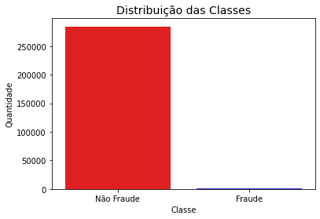
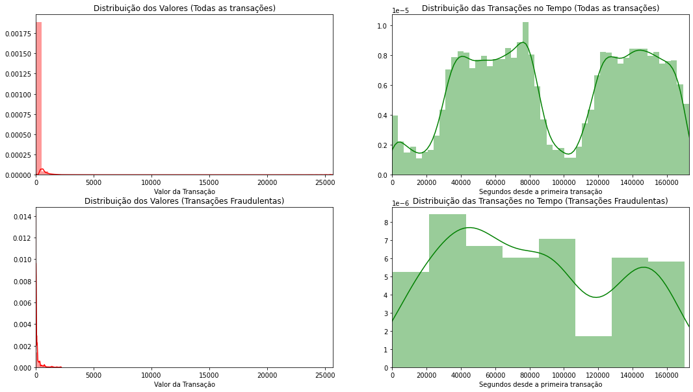
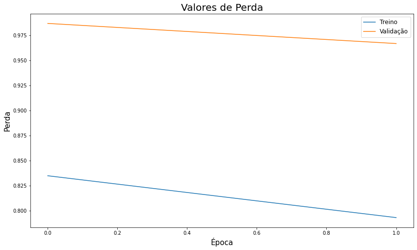
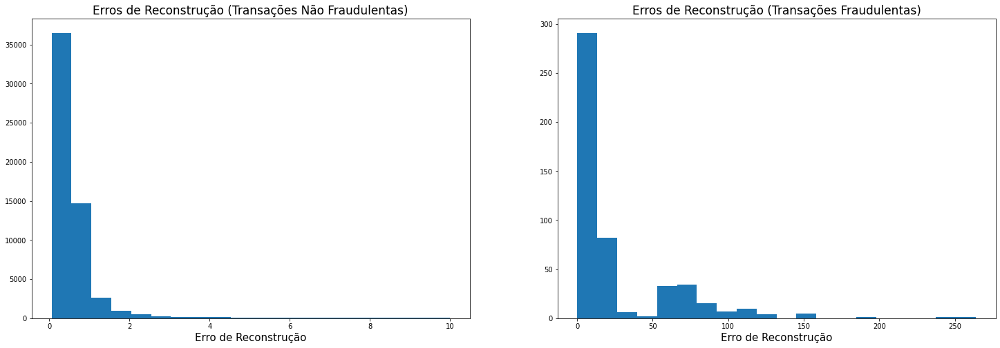
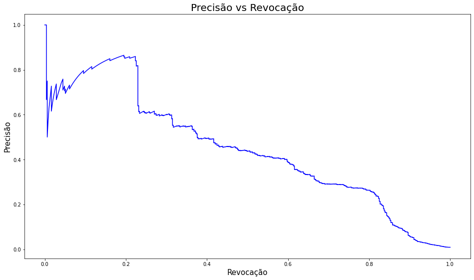
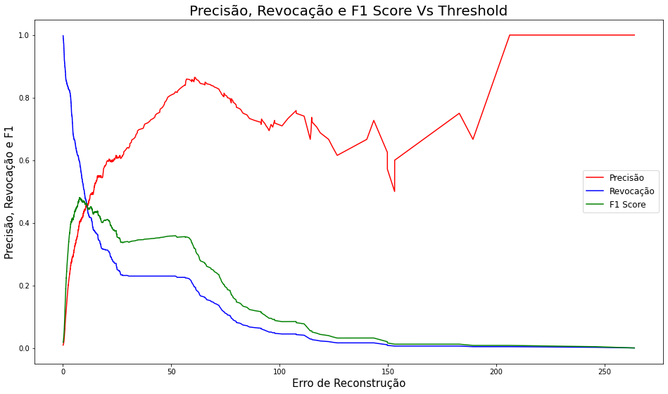
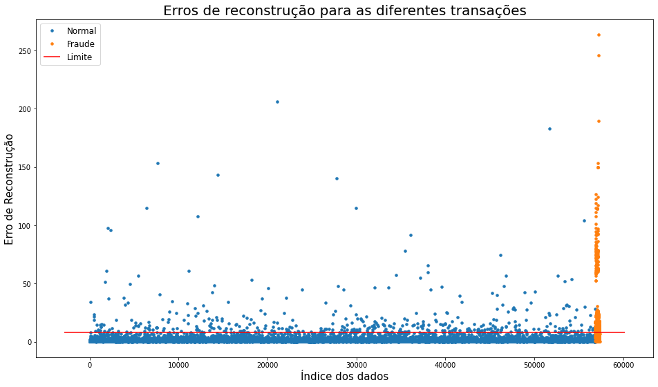
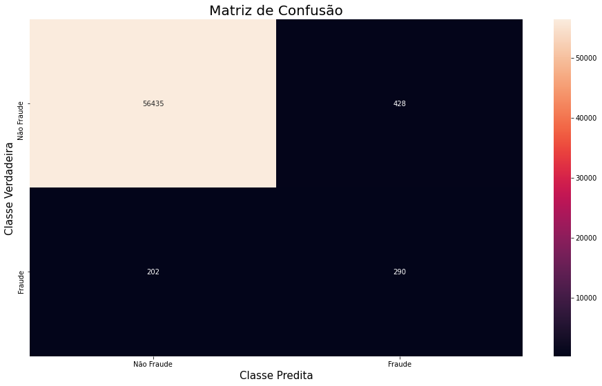
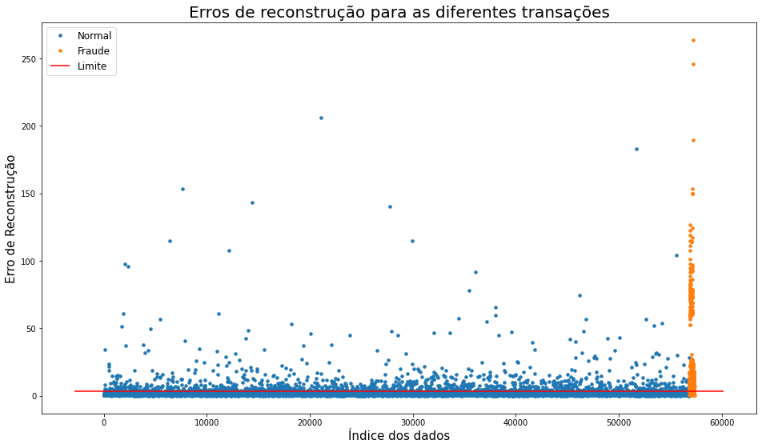

# Autoencoders para Detecção de Fraudes

**Autor**: Matheus Jericó Palhares <br>
**LinkedIn**: https://linkedin.com/in/matheusjerico

**Referências:**

https://www.pyimagesearch.com/2020/03/02/anomaly-detection-with-keras-tensorflow-and-deep-learning/

### Conjunto de Dados - Credit Card Fraud Detection
**Link**:<br> https://www.kaggle.com/mlg-ulb/creditcardfraud

**Contexto**: <br>
É de extrema importância que as empresas identifiquem e reconheçam transações fraudulentas com cartão de crédito, para que os clientes não sejam cobrados pelos itens que não compraram e as empresas não tomem prejuízo devido à fraude (Kaggle, 2020).

**Conteúdo**:<br>
O dataset contém transações realizadas com cartões de crédito em setembro de 2013 por portadores de cartões europeus. Este conjunto de dados apresenta transações que ocorreram em dois dias, nas quais temos 492 fraudes em 284.807 transações. O conjunto de dados é altamente desequilibrado, a classe positiva (fraudes) representa 0,172% de todas as transações (Kaggle, 2020).<br>

O dataset contém apenas variáveis de entrada numéricas que são o resultado de uma transformação PCA. Infelizmente, devido a problemas de confidencialidade, não é possível utilizar os recursos originais e mais informações básicas sobre os dados. Features de V1, V2, até V28 são os principais componentes obtidos com o PCA, os únicos recursos que não foram transformados com o PCA são 'Tempo' e 'Valor'. O recurso 'Tempo' contém os segundos decorridos entre cada transação e a primeira transação no conjunto de dados. O recurso 'Valor' é o valor da transação, esse recurso pode ser usado para aprendizado sensível a custos dependente de exemplo. O recurso 'Classe' é a variável de resposta e assume o valor 1 em caso de fraude e 0 em caso contrário (Kaggle, 2020).

**Resolução**: <br>

Para resolução do problema, utilizamos Autoendoder, que é uma técnica de aprendizado não supervisionado de Deep Learning, para identificar anomalias.

Para implementar a solução do modelo de Redes Neurais (Auto Encoder) utilizamos o framework TensorFlow 2.0.

## Como foi desenvolvida a Solução?
A solução foi desenvolvida utilizando a linguagem de programação Python e o framework Jupyter Notebook para arquitetura e documentação da implementação. Os passos seguidos para o desenvolvimento:
### 1. Importar as bibliotecas:
- Pandas: Importar o dataset e realizar manipulações com dataframe.
- Numpy: Manipular conjunto de dados e trabalhar com métodos matemáticos.
- Matplotlib e Seaborn: Construção e visualização gráfica.
- Scikit-learn: Aplicar técnicas de normalização e padronização dos dados. Dividir os dados em treinamento, validação e teste. Calcular das métricas de validação dos algorítmos.
- Tensorflow 2.0: Criar e treinar o Auto Encoder

### 2. Carregar o conjunto de dados:
- Utilizamos a biblioteca Pandas para carregar o conjunto de dados, extrair as informações sobre os tipos dos dados presentes no dataset e verificar a existência de valores faltantes (NaN). Além de realizar a análise na distribuição dos dados (média, mediana, desvio padrão e quartis).

### 3. Análise Exploratória:

#### 3.1. Distribuição dos Dados com base na Classe:

```
    Distribuição das classificações dos dados:
    Transações Não Fraudulentas: 99.83%.
    Transações Fraudulentas: 0.17%.
```




**Análise**: O dataset é originalmente desbalanceado. A maior parte dos dados são representados por transações não fraudulentas. Tendo em vista que, analisando os dados de uma empresa fictícia, podemos ter grande similaridade na distribuição dos dados de fraude com o apresentado neste dataset.

#### 3.2. Existe diferênça nos valores das transações fraudulentas e não fraudulentas?

```
    Transações Não Fraudulentas:
    count    284315.000000
    mean         88.291022
    std         250.105092
    min           0.000000
    25%           5.650000
    50%          22.000000
    75%          77.050000
    max       25691.160000
    Name: Amount, dtype: float64
```
```    
    Transações Fraudulentas:
    count     492.000000
    mean      122.211321
    std       256.683288
    min         0.000000
    25%         1.000000
    50%         9.250000
    75%       105.890000
    max      2125.870000
    Name: Amount, dtype: float64
```

**Análise**: As transações não fraudulentas possuem uma gama de valores de transação muito maior do que as transações fraudulentas. Também é possível observar que as transações com maiores valores são classificadas como não fraudulentas.

#### 3.3. Distribuição das Transações




**Análise**: É possível observar que não há uma grande diferença na distribuição dos valores das transações e no horário delas entre as fraudulentas e a totalidade de transações.


### 4. Processamento dos dados

#### 4.1. Aplicar técnica de padronização na feature 'Amount'.
- Aplicamos a técnica pois a feature apresenta uma gama grande de valores. Utilizamos a biblioteca Standard Scaler do scikit-learn para padronizar a feature *Amount*. A ideia de utilizar essa transformação é fazer com que os valores da feature possua média 0 e devio padrão igual a 1. Transformando a distribuição da features em uma distribuição normal.

#### 4.2. Separar os dados normais dos dados fraudulentos.
- O Auto Encoder foi treinado apenas com os dados não fraudulentos. Essa técnica é utilizada para que a Rede Neural aprenda a codificar apenas os dados não frauduletos. Após realizar o treinamento do Auto Encoder, o mesmo poderá codificar e decodificar as informações de uma transação normal com baixo valor de erro de reconstrução. Quando o Auto Encoder for codificar e decodificar uma transação fraudulenta, o valor do erro de reconstrução da transação será muito superior a média dos valores do erro de reconstrução das transações normais. Dessa forma utilizamos o Auto Encoder para detecção de anomalia.

#### 4.3. Separar dados de Treino e Teste.

    Dimensionalidade dos dados:
    Treinamento: (227452, 29)
    Teste (Fraudulentos): (492, 30), Teste (Não Fraudulentos): (57355, 29)


### 5. Autoencoder

#### 5.1. Introdução

Para o treinamento do Autoencoder são utilizados apenas os dados referentes às transações não fraudulentas. Durante o treinamento, o codificador verá milhões de transações não fraudulentas com cartão de crédito.

Dessa forma, o Autoencoder codifica as informações mais relevantes dos dados não fraudulentos. Intuitivamente, podemos dizer que dessa maneira o algoritimo aprende apenas o que é uma transação de cartão de crédito absolutamente normal.

E esse conceito aprendido de uma transação normal com cartão de crédito pode ser encontrado como a representação latente na camada intermediária, usada para recriar os recursos originais usados como dados de entrada para o Autoencoder.

Após o treinamento com os dados não fraudulentos, podemos finalmente usar o Auto Encoder para detectar as anomalias (fraudes).

Com isso, é possível mostrar para o Auto Encoder os dados de ambos os tipos - anomalias e dados normais. Como antes, os recursos de entrada são codificados pelo Autoencoder em uma representação latente que é usada para reconstruir a entrada. Os dados de fraude vãão possuir um erro de reconstruçãão muito superior aos dados normais, pois o Auto Encoder aprendeu a codificar dados de transaçõões normais.


**OBS:**

Caso o Autoencoder seja treinado corretamente, esperamos que o erro entre a saída e a entrada seja muito pequeno para dados normais.

Entretanto, esse não é o caso das anomalias ou, no nosso caso, transações fraudulentas de dados.

Durante o treinamento o codificador automático aprendeu apenas os conceitos e características da instância normal de dados. Isso significa que os pesos do Autoencoder foram ajustados apenas para codificar e reconstruir dados normais (transações não fraudulentas).

Se tentarmos codificar uma transação fraudulenta, a representação latente dessa transação seria significativamente diferente da representação latente de uma transação normal.

Como resultado direto, a entrada reconstruída diferiria ainda mais da entrada original, resultando em um erro muito maior do que no caso de transações normais.

O conhecimento do fato de que dados de entrada fraudulentos resultam em valores de perda mais altos da função de perda de erro quadrático médio (MSE - *Mean Squared Error*) pode ser usado ao nosso favor. Tudo o que precisamos fazer é encontrar um limite de perda que distinga os dados normais dos fraudulentos (*threshold*).

Na prática, isso significa que instâncias de dados para as quais obtemos um valor de perda acima desse limite classificam essa instância como uma transação fraudulenta.

Por outro lado, instâncias de dados com valores de perda abaixo desse limite podem ser consideradas dados normais ou transações não fraudulentas.

    Caso 1: O valor da perda MSE para um recurso de entrada está acima do limiar de perda → o recurso de entrada é uma transação fraudulenta
    Caso 2: O valor da perda MSE para um recurso de entrada está abaixo do limite → o recurso de entrada é uma transação não fraudulenta


#### 5.2. Construção do Auto Encoder utilizando o framework Keras
- Utilizamos duas camadas de codificação e duas camadas de decodificação. As funções de ativação que utilizamos foi a ReLu. Utilizamos o otimizador Adam, e a função de perda MSE.

```python
# Dimensões dos dados de entrada
input_dim = X_train.shape[1]

input_layer = Input(shape=(input_dim, ))

# Camadas de encoding
encoder = Dense(18, activation="relu")(input_layer)
encoder = Dense(14, activation="relu", activity_regularizer=regularizers.l2(10e-5))(encoder) 
encoder = Dense(10, activation="relu")(encoder)

# Camadas de decoding
decoder = Dense(14, activation='relu')(encoder)
decoder = Dense(18, activation='relu')(decoder)
decoder = Dense(input_dim, activation='relu')(decoder)

autoencoder = Model(inputs=input_layer, outputs=decoder)

autoencoder.compile(optimizer='adam', loss='mean_squared_error', metrics=['accuracy'])

checkpointer = ModelCheckpoint(filepath="./model/model.h5", verbose=0, save_best_only=True)

tensorboard = TensorBoard(log_dir='./logs', histogram_freq=0, write_graph=True, write_images=True)
```

#### 5.3. Sumário da Rede Neural

    Model: "model"
    _________________________________________________________________
    Layer (type)                 Output Shape              Param #   
    =================================================================
    input_1 (InputLayer)         [(None, 29)]              0         
    _________________________________________________________________
    dense (Dense)                (None, 18)                540       
    _________________________________________________________________
    dense_1 (Dense)              (None, 14)                266       
    _________________________________________________________________
    dense_2 (Dense)              (None, 10)                150       
    _________________________________________________________________
    dense_3 (Dense)              (None, 14)                154       
    _________________________________________________________________
    dense_4 (Dense)              (None, 18)                270       
    _________________________________________________________________
    dense_5 (Dense)              (None, 29)                551       
    =================================================================
    Total params: 1,931
    Trainable params: 1,931
    Non-trainable params: 0
    _________________________________________________________________


#### 5.4. Treinamento do Auto Encoder
- Após o treinamento, o modelo foi salvo no diretório ```/model```

```python
EPOCHS = 15
BS = 32

history = autoencoder.fit(X_train, X_train,
                          epochs = EPOCHS, 
                          batch_size = BS,      
                          shuffle=True,
                          validation_data=(X_test, X_test),
                          verbose=1).history
```

#### 5.5. Gráfico de Erro de Validação do Modelo



### 6. Predição

#### 6.1. Demonstração dos erros de reconstrução nos dados de Teste




**Análise**: Os erros de reconstrução, em sua maioria, são valores baixos, visto que representam as transações não fraudulentas. Já a grande parte dos erros mais altos é representativa das transações fraudulentas. Para a definição de melhor valor limite para diferenciar as transações fraudulentas das não fraudulentas, é preciso utilizar algumas métricas.

### 7. Métricas

#### 7.1 Precisão vs Revocação (Recall)


Precisão e Recall são definidos das seguintes maneiras:

**Precisão** (também chamada de valor preditivo positivo) é a fração de instâncias recuperadas que são relevantes.

**Revocação** (também conhecida como sensibilidade) é a fração de instâncias relevantes que são recuperadas. 

Tanto precisão quanto revocação são, portanto, bases para o estudo e compreensão da medida de relevância.

Alto recall, mas baixa precisão significa muitos resultados, a maioria dos quais tem pouca ou nenhuma relevância. Quando a precisão é alta, mas o recall é baixo, temos o oposto - poucos resultados retornados com uma relevância muito alta. Normalmente, o resultado ideal seria ter uma alta precisão e alto recall.

#### 7.2 F1 Score

F1 Score é uma medida que combina precisão e revocação é a média harmónica entre precisão e revocação

Esta medida é aproximadamente a média de ambas quando seus valores estão próximos, e de maneira mais geral, o quadrado da média geométrica dividido pela média aritmética. Há várias razões pelas quais o F1 Score pode ser criticado em casos específicos devido ao seu viés como métrica de avaliação.

**Fonte**: https://pt.wikipedia.org/wiki/Precis%C3%A3o_e_revoca%C3%A7%C3%A3o

#### 7.3 Comparação das métricas para o modelo gerado




**Análise:** Uma área alta sob a curva representa alta revocação e alta precisão, onde alta precisão se refere a uma baixa taxa de falsos positivos e alta revocação se refere a uma baixa taxa de falsos negativos. As pontuações altas de ambos mostram que o classificador está retornando resultados precisos (alta precisão), além de retornar a maioria de todos os resultados positivos (alta revocação).





**Análise**: É possível observar que, à medida que o erro de reconstrução aumenta, nossa precisão também aumenta. Já na para a revocação temos a situação exatamente oposta. À medida que o erro de reconstrução aumenta, a revocação diminui. O mesmo acontece com o valor de F1 Score.


##### 7.3.1. Valor balanceado entre Precisão e Revocação
- Utilizando um threshold que otimiza o valor da métrica F1-Score, balanceado entre precisão e Revocação
```
    Valor máximo de  F1 Score:  0.4805945499587118
```




#### 7.3. Matriz de Confusão
- O valor de Threshold utilizado foi o valor que representa o maior resultado para a métrica de F1-Score.




                  precision    recall  f1-score   support
    
               0       1.00      0.99      0.99     56863
               1       0.40      0.59      0.48       492
    
        accuracy                           0.99     57355
       macro avg       0.70      0.79      0.74     57355
    weighted avg       0.99      0.99      0.99     57355
    


### AJUSTE FINO: Otimizando valor de Threshold para melhor resultado de Revocação
- O objetivo é minimizar o falso negativo, o caso de ser uma transaçãão fraudulenta e o algoritmo predizer que é uma transaçãão normal. Threshold igual a 3.2.




                  precision    recall  f1-score   support
    
               0       1.00      0.98      0.99     56863
               1       0.24      0.82      0.37       492
    
        accuracy                           0.98     57355
       macro avg       0.62      0.90      0.68     57355
    weighted avg       0.99      0.98      0.98     57355
    

